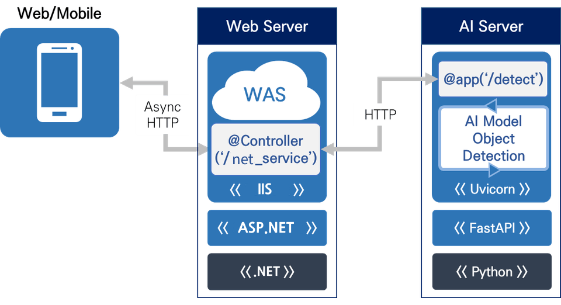
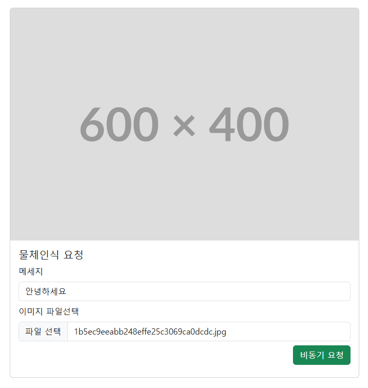
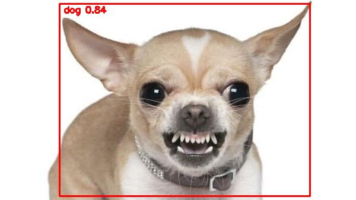
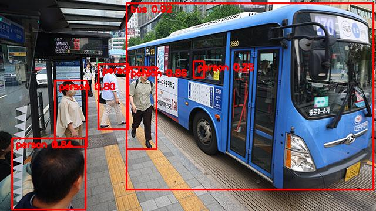

# 미니프로젝트 4  
## Python AI (API 연동) + ASP.NET Core 연동 프로젝트  

---

## 📑 목차
1. Python  
   - 파이썬 웹 애플리케이션 프레임워크  
   - FastAPI  
   - 데이터 유효성 검사 (pydantic)  
   - 전체 통합  
2. ASP.NET Core  
   - 프로젝트 개요  
   - 파이썬 웹서버 송신 데이터 처리  
3. 파이썬 AI Server 구현  
   - 필요 라이브러리  
   - AI Server 실행  
   - 이미지 객체 탐지 앱 추가  
   - ASP.NET Core 웹페이지 (결과 화면)  

---

## 1. Python  

### 1-1. 파이썬 웹 애플리케이션 프레임워크  
1. **Django**  
   - 대규모 웹 애플리케이션 개발에 사용되는 풀스택 프레임워크  
   - 구조화가 잘 되어 있으나 상대적으로 무거움  

2. **Flask**  
   - 소규모 웹 애플리케이션 개발에 적합한 마이크로 프레임워크  
   - 가볍지만 필요한 기능을 개발자가 직접 구현해야 함  

3. **Uvicorn**  
   - 초경량 ASGI 서버, FastAPI와 함께 주로 사용됨  
   - 매우 가볍고 빠른 성능 제공  

---

### 1-2. FastAPI  
- RESTful API를 손쉽게 만들 수 있는 웹 프레임워크  
- **Uvicorn**과 함께 실행하여 높은 성능과 비동기 지원 제공  

#### 패키지 설치  
```shell
pip install fastapi uvicorn
```
> [소스](./pythonAI/step1/main01.py)

### 1-3. 데이터 유효성 검사 (pydantic) 
- Pydantic을 사용하여 데이터 유효성 검사 및 직렬화/역직렬화 처리
> [소스](./pythonAI/step1/main02.py)

### 1-4. 전체 통합
- FastAPI + Uvicorn + Pydantic 조합을 통한 API 서버 통합 코드
> [소스](./pythonAI/step1/main03.py)

---
### 2. ASP.NET Core

- 파이썬에서 만들어져서 Uvicorn으로 전달되는 데이터를 수신받아 표현하는 웹앱
- ASP.NET Core 비어있는 프로젝트로 생성 (MVC 생성 시 필요없는 파일 다수 발생)
- HTTPS 옵션 해제

> [소스](./backend/ASPWebSolution/TestWebApp/Program.cs)

### 2-1. 파이썬 웹서버 송신 데이터 처리

- HTML에서 JavaScript로 처리
- ASP.NET Core API 경유 처리

---

### 3. 파이썬 AI Server 구현
#### 3-1. 필요 라이브러리(패키지 설치)
- fastapi
- uvicorn
- pydantic
- Pillow : 이미지 열기, 저장
- numpy : 수치 연산
- requests : HTTP 요청
- opencv-python : 이미지, 비디오 처리
- python-multipart : 멀티파트(이미지, 비디오) 파싱
- ultralytics : YOLO 이미지, 동영상 객체 탐지

```shell
> pip install Pillow numpy requests opencv-python python-multipart
```

- ultralytics : YOLO 이미지, 동영상 객체 탐지
```shell
> pip install torch torchvision --index-url https://download.pytorch.org/whl/cu126
```



--- 

### 3-2. AI Server 실행
- 웹서버 실행
> [소스](./pythonAI/step2/main01.py)

### 3-3. 이미지 객체 탐지 앱 추가
- ASP.NET에서 전달된 이미지를 객체 인식한 뒤 다시 응답하는 웹서비스
- 웹서버 + YOLO 객체 탐지
> [소스](./pythonAI/step2/main02.py)

### 3-4. ASP.NET Core 웹페이지 (결과 화면)

- 이미지를 AI Server로 전달하고 결과를 돌려받는 웹사이트
- index.html 작업



- 기본 웹 화면 예시

- API controller 작업
   - net_service API 컨트롤러 구현

- 결과(YOLO 탐지 결과)

<br>


- 최종 결과
   
https://github.com/user-attachments/assets/1f75e6d8-c8d6-4612-aecd-cb604597b1c5

--- 

##### 주의점
- index.html의 form태그 내 input은 전부 name이 필요함. Javascript의 입력값 수집객체 FormData() 에서 name 속성 사용함
- `xhr.open('POST', 'http://localhost:5200/net_service', true);`에서 쓰이는 API NetController 작성 필요


### 실시간 웹캠/동영상 물체인식 
- 여기서는 uvicorn와 FastApi의 웹서비스 사용하지 않음
- MQTT 웹소캣을 통해서 물체인식하는 실시간 웹캠이나 동영상을 전달하는 예제

#### MQTT 브로커 설정 추가
- 웹소켓 연결을 위해서 MQTT 브로커 서버에 추가 설정필요

```c
# 기본 MQTT
listener 1883
protocol mqtt

# WebSocket용
listener 9001
protocol websockets
```

```shell
winget install mosquitto 설치!
```

#### 파이썬 AI 작성
- 웹캠 및 동영상 분리
- 이미지의 경우 base64로 인코딩되어 프레임별로 MQTT 브로커로 전달됨


##### 웹캠

[소스](./pythonAi/step3/main01.py)


##### 동영상

[소스](./pythonAi/step3/main02.py)


#### ASP.NET Subscribe Server
- 이전 소스에서 Program.cs 수정 및 streamming.html만 작성

[소스](./backend/ASPWebSolution/ASPWebApp/Program.cs)
[소스](./backend/ASPWebSolution/ASPWebApp/wwwroot/streaming.html)

웹캠 결과화면


동영상 결과화면

https://github.com/user-attachments/assets/70a96e30-6dc5-4077-a345-a8ef56810652


#### 추가내용
- yolov8n.pt, yolov8m.pt, yolov9c.pt 중 yolov8n.pt가 처리속도 빠름

| 모델 이름        | 설명          |  특징           |
| ------------ | ----------- |  ------------ |
| `yolov8n.pt` | **Nano 모델** | 가장 작고빠름, 속도 우선        |
| `yolov8s.pt` | Small       | 적당한 속도, 범용           |
| `yolov8m.pt` | Medium      | 정확도 ↑ 느림      |
| `yolov8l.pt` | Large       | 고성능 느림      |              |
| `yolov8x.pt` | Xtreme      | 가장 느림. 연구용 or 서버 전용 |
| `yolov9c.pt` | Compact   | 작은 모델, 빠름    |
| `yolov9e.pt` | Efficient | 정확도/속도 밸런스   |
| `yolov9s.pt` | Small     | YOLOv8s보다 향상 |
| `yolov9m.pt` | Medium    |              |
| `yolov9l.pt` | Large     |              |
| `yolov9x.pt` | Xtreme    | 최고 정확도       |
